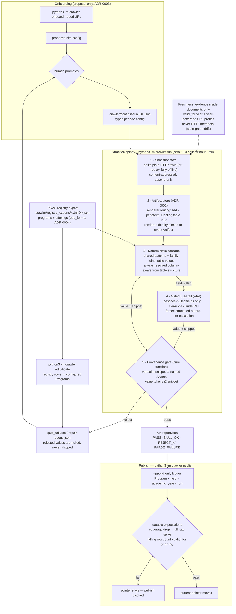

# RFC_C_Hybrid_Crawler

Extraction pipeline for Bulgarian university degree-program data
(tuition, admission, degree, duration, language), sourced from the RSVU
registry and 51 heterogeneous university websites, with verbatim
provenance on every shipped value.

Design (ADR-0001): a **deterministic extraction cascade** carries the
structured share (~87% measured on the benchmark, €0 and 0 tokens per
refresh); a **gated LLM tail** absorbs the prose share for
cascade-nulled fields only; one **mechanical provenance gate** — a pure
function, no LLM in the loop — decides what ships. Site knowledge is
config data proposed by onboarding agents and promoted by a human; no
LLM and no per-site code runs in the production refresh loop for the
deterministic share. See `CONTEXT.md` for the domain language and
`docs/adr/` for the decision records.

## Pipeline



## Quick start

```bash
# run the test suite (fresh clone: 12 designed skips for excluded data)
python3 -m unittest discover -s crawler/tests -p "test_*.py"

# structural validation
python3 -m crawler validate
```

Docling Serve is required only for the table-pdf render route
(html / prose-pdf / spreadsheet routes run without it):

```bash
docker compose up -d   # pins ghcr.io/docling-project/docling-serve-cpu:v1.28.0
```

## CLI

```bash
python3 -m crawler run <UniID> [--replay DIR] [--tail]     # store → render → cascade → gate → run-report.json
python3 -m crawler publish <UniID> [--academic-year YYYY/YYYY]  # run + ledger + expectations → publish-report.json
python3 -m crawler adjudicate <UniID>                      # match RSVU rows ↔ Programs, fill repair queue
python3 -m crawler onboard <UniID> --seed URL              # propose a site config (never auto-promoted)
python3 -m crawler grade <UniID> --run-report P --key P    # score a run against a benchmark key
python3 -m crawler labelkit <UniID>                        # label-collection worksheet for a config
python3 -m crawler check-pins <UniID>                      # verify configured URL pins still resolve
```

`--replay DIR` runs the whole spine offline against a spike cache — zero
network by construction. `--tail` enables the gated LLM tail through the
`claude` CLI (subscription auth, no `ANTHROPIC_API_KEY`); without it a
cascade-nulled field ships an explicit null and the run makes zero LLM
calls.

## Repository layout

```
crawler/            the pipeline (store, render, cascade, llm_tail,
                    provenance, ledger, publish, staleness, …)
crawler/configs/    promoted per-site configs (data, not code)
crawler/tests/      477 unit tests, offline by construction
docs/adr/           decision records (start with 0001)
docs/agents/        agent operating notes
scripts/            Docling convenience wrappers
CONTEXT.md          domain language — read before touching anything
```

## Invariants worth knowing before contributing

- Snapshots are append-only and content-addressed; Artifacts carry
  renderer identity; Provenance is only ever checked against an
  Artifact's exact text (ADR-0002).
- A value whose snippet does not literally contain it has no provenance
  and does not ship, whatever produced it.
- Table values are never free-read by an LLM — the deterministic
  column resolver decides, even when an LLM proposed the row.
- Onboarding proposes; a human promotes (ADR-0003). Offerings are
  registry-enumerated, never restated in config (ADR-0004).
- Freshness trusts only evidence inside documents (`valid_for`,
  year-patterned successor URLs) — never HTTP 200s or byte hashes.
