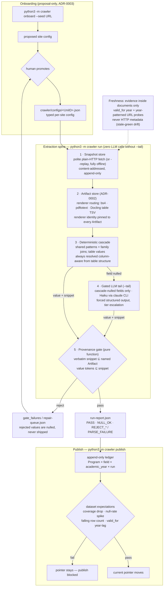

# RFC_C_Hybrid_Crawler

Extraction pipeline for Bulgarian university degree-program data
(tuition, admission, degree, duration, language), sourced from
heterogeneous Bulgarian university websites (8 configured today) (ADR-0006: no external registry), with verbatim
provenance on every shipped value.

Design (ADR-0001): a **deterministic extraction cascade** carries the
structured share (48% of fields across the 8-university benchmark;
100% at two of them, €0 and 0 tokens per refresh); a **gated LLM tail** absorbs the prose share for
cascade-nulled fields only; one **mechanical provenance gate** — a pure
function, no LLM in the loop — decides what ships. Site knowledge is
config data proposed by onboarding agents and promoted by a human; no
LLM and no per-site code runs in the production refresh loop for the
deterministic share. See `CONTEXT.md` for the domain language and
`docs/adr/` for the decision records.

## Benchmark results — 8 universities, 190 blind-graded cells

Two rendered reports live in `docs/` (open them in a browser):

- **[docs/rfc-c.html](docs/rfc-c.html)** — RFC-C rev. 3, the STA-78 design
  document, rewritten against the complete evidence.
- **[docs/scorecard.html](docs/scorecard.html)** — the full scorecard:
  per-university numbers, every `crawler validate` row, and the recorded
  site findings.
- **[docs/missing-matrix.html](docs/missing-matrix.html)** — the missing-data
  matrix: 8 universities × 5 fields, each cell with count, cause and affected
  programs; 397/740 cells split into recoverable config work (~140),
  fetch-route limits (80, NBU's JS) and labeller-confirmed honest nulls.

| | |
| -- | -- |
| Universities · programs | 8 · 148 |
| Fields extracted | 353 / 740 (48%) |
| Blind-graded cells | 190 (5-program sample per uni) |
| Graded correct | 125 / 190 (66%) |
| Wrong values | 12 |
| **Fabrications** | **3** |
| Gate failures | **0**, across all 148 programs |

### Read this before quoting the numbers

Earlier revisions of this work led with **“0 fabrications”**. That was true
across the first 190 graded cells and **is no longer true**. Extending the
benchmark to all eight universities produced 3 fabrications and 12 wrong
values, concentrated in one failure mode the earlier samples never reached:
**misattribution on shared pages** — a program shipping a neighbour's value.
The value is verbatim in the artifact, so the provenance gate passes it.

The gate's guarantee is real but narrower than we stated:

- it has **never** shipped a value absent from its source artifact — that held
  across every site shape tested;
- it **cannot** verify that a value belongs to the program it was attached to.

Every defect above was found by human labels in the blind benchmark. **None was
found by the pipeline's own checks.** The evidence — frozen keys, verdicts,
worksheets, findings — is tracked in [`benchmark/`](benchmark/README.md) and by
protocol can never be regenerated.

## Pipeline



## Quick start

```bash
# run the test suite (fresh clone: 12 designed skips for excluded data)
python3 -m unittest discover -s crawler/tests -p "test_*.py"

# structural validation
python3 -m crawler validate
```

Docling Serve is required only for the table-pdf render route
(html / prose-pdf / spreadsheet routes run without it):

```bash
docker compose up -d   # pins ghcr.io/docling-project/docling-serve-cpu:v1.28.0
```

## CLI

```bash
python3 -m crawler run <UniID> [--replay DIR] [--tail]     # store → render → cascade → gate → run-report.json
python3 -m crawler publish <UniID> [--academic-year YYYY/YYYY]  # run + ledger + expectations → publish-report.json
python3 -m crawler onboard <UniID> --seed URL              # propose a site config (never auto-promoted)
python3 -m crawler grade <UniID> --run-report P --key P    # score a run against a benchmark key
python3 -m crawler labelkit <UniID>                        # label-collection worksheet for a config
python3 -m crawler check-pins <UniID>                      # verify configured URL pins still resolve
```

`--replay DIR` runs the whole spine offline against a spike cache — zero
network by construction. `--tail` enables the gated LLM tail through the
`claude` CLI (subscription auth, no `ANTHROPIC_API_KEY`); without it a
cascade-nulled field ships an explicit null and the run makes zero LLM
calls.

## Repository layout

```
crawler/            the pipeline (store, render, cascade, llm_tail,
                    provenance, ledger, publish, staleness, …)
crawler/configs/    promoted per-site configs (data, not code)
crawler/tests/      477 unit tests, offline by construction
docs/adr/           decision records (start with 0001)
docs/agents/        agent operating notes
scripts/            Docling convenience wrappers
CONTEXT.md          domain language — read before touching anything
```

## Invariants worth knowing before contributing

- Snapshots are append-only and content-addressed; Artifacts carry
  renderer identity; Provenance is only ever checked against an
  Artifact's exact text (ADR-0002).
- A value whose snippet does not literally contain it has no provenance
  and does not ship, whatever produced it.
- Table values are never free-read by an LLM — the deterministic
  column resolver decides, even when an LLM proposed the row.
- Onboarding proposes; a human promotes (ADR-0003). Offerings are
- Programs are hand-authored config entries — the unit of identity (ADR-0006).
- Freshness trusts only evidence inside documents (`valid_for`,
  year-patterned successor URLs) — never HTTP 200s or byte hashes.
