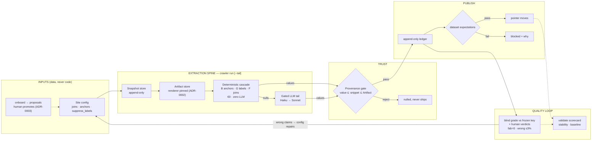

# Pipeline architecture — 2026-08-17

One-screen view, left → right: inputs → extraction spine → trust gates → publish → quality loop.
Detail lives in [workflow.md](workflow.md); decisions in [adr/](adr/).

## Invariants (one line each)

| # | Invariant | Where |
| -- | -- | -- |
| 1 | No per-site code; site knowledge is strictly-validated config data | ADR-0001, `config.py` |
| 2 | Every EXTRACTED value carries verbatim, gate-checked Provenance — no human exemption | ADR-0002, `provenance.py` |
| 2b | A value true but stated nowhere ships as DERIVED, never as PASS — the gate cannot emit DERIVED | ADR-0007, `runner.derive_fields` |
| 3 | Onboarding proposes; only humans promote configs | ADR-0003, `onboarding.py` |
| 4 | No external registry: config program entries are the unit of identity | ADR-0006 |
| 5 | "Can't determine" ships as null — never a plausible value | gate + `suppress_labels` |
| 6 | Snapshots append-only; re-extraction from snapshots is cheap (shadow runs) | `store.py`, `publish(report=)` |
| 7 | The gate proves presence, not truth — semantic wrongs are caught by the blind key + human verdicts | `grader.py` |
| 8 | The blind key is a sample; a right value from the wrong place is caught by reading every changed cell + an independent refuter | `celldiff.py`, `docs/agents/attribution-review.md` |

## Current benchmark state (VUM, 2026-08-17)

94.7% correct (71/75) · 0 fabrications · gate PASS (1.4% ≤ 3%) · tail 42 calls/run ·
open design gap: adjudicated-stale values must also bind the LLM tail (`.scratch/pipeline-e2e/issues/11`).
