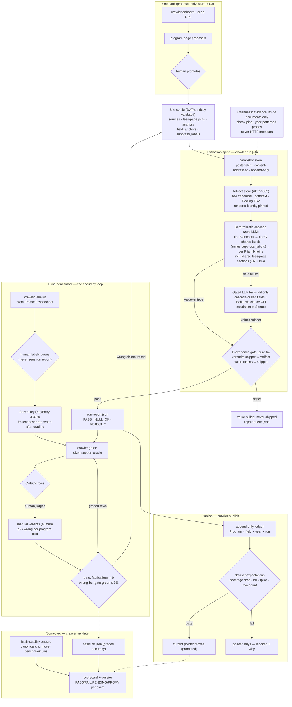

# Pipeline workflow — current version (2026-08-17)

The full DEC-1 workflow as it runs today: the extraction spine, the
publish gates, and the blind-benchmark loop that measures it. Updated for
the VUM benchmark round: shared BG label patterns, per-program
`suppress_labels` (human-adjudicated stale-green verdicts as config
data), shared fees-page joins on the BG site, and the manual-verdict
grade overlay. See README.md for the component-level spine diagram,
CONTEXT.md for the ubiquitous language, docs/adr/ for the decisions.

## What changed in this version (2026-08-17 VUM round)

| Change | Kind | Why |
| -- | -- | -- |
| `bg-lang-label` in the shared label library | shared code (generic) | «Език на преподаване» declarations outrank EN boilerplate prose; captures dual declarations whole («БЪЛГАРСКИ ИЛИ АНГЛИЙСКИ») |
| `suppress_labels` per program-field | config schema + cascade | human-adjudicated stale-green verdicts as config data — a verbatim-present but wrong-claim value falls through to the next tier or an honest null (vum-corr's stale «1100 leva») |
| `vum-fees-bg` fees-page joins | config data | tuition for BG-site programs lives only on «Стипендии и такси»; 8 programs joined, deterministic tuition coverage 3 → 11 |
| manual-verdict overlay exercised | process | CHECK rows (incl. process-page admission cells keyed by sentinel) settled by human ok/wrong; verdicts carried over only when shipped values are byte-identical |
| `labelkit` CLI un-dead-coded | bug fix | handler body sat unreachable inside the `check-pins` block |

## Attribution review — the gate outside the benchmark loop

The blind-benchmark loop above measures a 5-program sample per university.
It does not see cells no key covers, and the rev.5 round closed seven
fabrications that lived there — verbatim-present, gate-clean, invisible to
grading. So every change that can move a shipped value carries a review
that is scoped to *changed cells* rather than *graded cells*: read the
provenance of each one, then run an independent agent whose only job is to
refute the first.

This is a process gate, enforced by the ticket's done-check rather than by
code — the full procedure, the refuter's independence contract and the
decision rule are in `docs/agents/attribution-review.md`. The changed-cell
diff it runs on is `crawler diff` (status, value, method, artifact ref and
snippets — wider than `ledger.diff_runs`, which compares values alone and
cannot see a value whose provenance moved).

## The unattended loop (ADR-0005)

`crawler refresh` runs the publish flow above for every configured
university on a weekly cron, adds the version-pin drift check, and lands
everything needing judgment in the Attention Ledger — `crawler
attention` is the operator's backlog (aged; WARN 7d / ESCALATE 30d),
`crawler resolve` executes resolutions through the same gates. Exit is
non-zero only when a tick opens NEW work. See `docs/operations.md` for
the cron recipe and per-kind lifecycle.

## Known open edges

- **JS-injected content is invisible to the fetch route** — vum-tour-phd's
  fee block is Elementor-loaded; the fetched HTML contains no fee at all.
  Honest null today; the JS-heavy benchmark uni (AUBG) is where this gets
  addressed or formally bounded.
- **LLM tail cost** — $0.10/call vs the $0.06 bar (scorecard FAIL); the
  named cause is prompt bundling (one call per field today; bundling a
  program's nulled fields into one call is the designed remedy).
- **Spike-A replay cache absent on this machine** — CASCADE frozen
  acceptance stays PENDING by design; the cache would need to come from
  the machine that ran the original spike.
